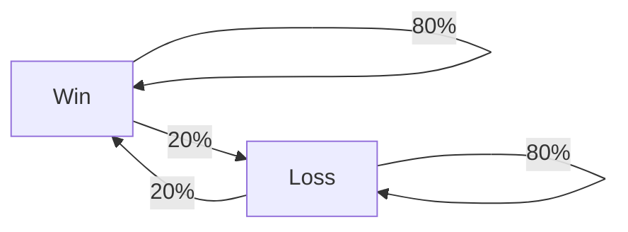
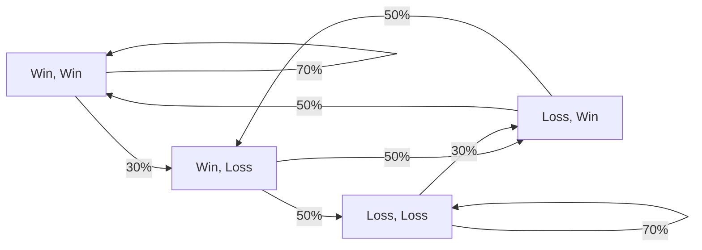

!!! abstract "TL;DR"
    - LoserQ should have a measurable impact on the history of games of players. 
    - As people would lose more right after losing, we should see clear deviation from randomness in the series.
    - Such a mechanism can be modeled using DTMC, where the present outcome depends on the previous games.

# Modeling the history

Imagine that a mechanism is acting on the matchmaking, such that the matches 
are not fair over time. This would undoubtedly lead to an increase in the lengths 
of the streaks of wins and losses, when compared to a fair matchmaking system. This is 
basically how people claim to detect the existence of a LoserQ system in the game. Many 
of have seen people sharing their history of games, and claiming that the streaks of losses
are too long to be random, and that Riot is intentionally making them lose (or win). In this 
section, I will investigate the history of games using the sample presented in the previous section.
But first, let's do a quick overview of how we can properly investigate these data.

## Let's meet with the data

Your history of games can be simply represented as a sequence of wins and losses. If I gather these sequence 
using Riot's API, I can easily plot it as a curve, as shown below. Behold, the history of `mopz24#EUW` :  

``` plotly
{"file_path": "loserQ/assets/history_single_player.json"}
```

As you can see, this looks like a fancy barcode. But there is no way to tell if anything 
special is happening here, but we will find later that there are better ways to display this kind of data 
so that we can learn more about the matchmaking system. A nice thing to do would be to plot this kind of stuff, but 
for several players within the same division. 

``` plotly
{"file_path": "loserQ/assets/history_multiple_players.json"}
```

This has now become a QRcode where the horizontal lines represent history of games for different players. I'll keep this convention 
in all the website. The pattern you can observe only emerge from the randomness of the process. This visualisation 
by itself has no use, but it is very helpful to construct an intuition about what the data looks like and how it should behave. 

Bigger streak in out sample, some stuff etc.

## Modeling the histories

!!! warning
    This section is an introduction to a mathematical model that will be used to investigate the history of games. This 
    is intended to be a high-level overview of the model, and is not necessary to understand the rest of the website. Feel
    free to skip if you hate maths and equations.

As seen below, game histories are a sequence on binary random variables $X = \text{Win}$ if this is a win and $X = \text{Loss}$ if it's a loss. 
The most straightforward way to model this is to flip a coin at each game, and assign a win or a loss depending on the outcome. 
From a probability point of view, doing this is equivalent to considering a Bernoulli process. Each game outcome is purely 
random, and do not depend on the previous games. In this situation, the outcome of game n°$n$ is a Bernoulli random variable : 

$$
P(X_n = \text{Win}) = p 
$$

The probability $p$ should be close to the player's winrate if we want it to model properly the player's history. Here, 
you might understand that this may be too simplistic, as we know that the outcome of a game can depend on the previous 
games. There are many factors (beside considering LoserQ) that can influence the outcome of a game depending on the previous
games played, such as the player's mood, the tiredness etc. To model this, we should consider a more complex process, 
where the outcome of a game depends on the previous games. This can be achieved using (Discrete Time) Markov Chains.
DTMCs are a very useful tool when it comes to describing random processes where the output at a given time depends on
a finite number of states in the past. Let's illustrate this with a chain which depends on the previous game only. Such
a chain can be represented as a graph :



The mathematical counterpart of this chain is encapsulated within 2 equations : 

$$ \left\{ \begin{array}{l}
P(X_n = \text{Win} | X_{n-1} = \text{Win}) = 80\% \\ P(X_n = \text{Loss} | X_{n-1} = \text{Loss}) = 80\%
 \end{array} \right.
$$

??? note 
    We only need to set half of the probabilities, since they add up to 1. If 
    $P(X_n = \text{Win} | X_{n-1} = \text{Win}) = 80\%$, then $P(X_n = \text{Loss} | X_{n-1} = \text{Win}) = 20\%$. This is
    a constraint that we must remember when setting things up.

These set of equations correspond to a chain where you are much more likely to win after a win, and to lose after a loss.
To draw samples from this chain, we start with a random state, and then we move to the next state with a probability
given by the arrows. For example, if we start with a win, we draw the next result between a win and a loss with a probability
of 80% and 20% respectively. This is a very simple example, but we can imagine more complex chains where the outcome of a 
game depends on the previous two games, or even more.



Here, there are 4 states to consider which are 1: (Win, Win), 2: (Win, Lose), 3: (Lose, Win), 4: (Lose, Lose). This kind
of graph is mathematically equivalent to what we would call a transition matrix $\mathcal{P}$ in the Markov Chain theory.
It is completely equivalent to the following matrix : 

$$
\mathcal{P} = \begin{pmatrix}
0.7 & 0.3 & 0 & 0 \\
0 & 0 & 0.5 & 0.5 \\
0.5 & 0.5 & 0 & 0 \\
0 & 0 & 0.3 & 0.7
\end{pmatrix}
\text{ where } \mathcal{P}_{ij} = P(X_n = \text{state j} | X_{n-1} = \text{state i})
$$

??? note 
    The transition matrix is a stochastic matrix. Each line adds up to 1, which means that the sum of the probabilities
    of moving to the next state is 1. It means that you must end up somewhere at each iteration, which is equivalent to
    saying that the sum of the probabilities of each arrow departing from a node is 1.

??? danger "Nigthmare fuel"
    
    You can imagine monstrosities or other biblically acurate angels when considering that the outcome of a game 
    depends on more previous played games. As the number of states to consider grows exponentially, the associated 
    graph becomes unreadable. For example, the graph below represents a chain where the outcome of a game depends 
    on the previous 4 games.

    ``` mermaid
    graph TB
        LLLL --> |75%| LLLL
        LLLL --> |25%| LLLW
        LLLW --> |67%| LLWL
        LLLW --> |33%| LLWW
        LLWL --> |67%| LWLL
        LLWL --> |33%| LWLW
        LLWW --> |50%| LWWL
        LLWW --> |50%| LWWW
        LWLL --> |67%| WLLL
        LWLL --> |33%| WLLW
        LWLW --> |50%| WLWL
        LWLW --> |50%| WLWW
        LWWL --> |50%| WWLL
        LWWL --> |50%| WWLW
        LWWW --> |34%| WWWL
        LWWW --> |66%| WWWW
        WLLL --> |67%| LLLL
        WLLL --> |33%| LLLW
        WLLW --> |50%| LLWL
        WLLW --> |50%| LLWW
        WLWL --> |50%| LWLL
        WLWL --> |50%| LWLW
        WLWW --> |34%| LWWL
        WLWW --> |66%| LWWW
        WWLL --> |50%| WLLL
        WWLL --> |50%| WLLW
        WWLW --> |34%| WLWL
        WWLW --> |66%| WLWW
        WWWL --> |34%| WWLL
        WWWL --> |66%| WWLW
        WWWW --> |25%| WWWL
        WWWW --> |75%| WWWW
    ```

In the most general case, the probability of winning
a game depends on the $m$ previous game's outcome, which can be written as : 

$$
P(X_n = 1 | X_{n-1}, X_{n-2} ..., X_{n-m}) = f(X_{n-1}, X_{n-2} ..., X_{n-m})
$$

If we consider that the outcome of a game depends only on the previous game, we can write :

$$
P(X_i = 1 | X_{i-1}) = f(X_{i-1})
$$

This is the modelisation I will use in the next sessions in my analysis. In my opinion, this is a very well motivated 
model for the following reasons : 

- It is **simple** to implement and to understand. This kind of model is very handy when it comes to explainability
  (unlike your favorite AI models), and the mathematics behind it are very simple, making it easy to use various 
  observables and compute the associated significance.
- It is **powerful**. This model can capture a lot of different patterns, and can be used to investigate the history
  of games in a very efficient way.
- It is **flexible**. You can easily change the number of previous games to consider, and the probabilities associated
  with each state. This is very useful when you want to investigate different hypothesis about the matchmaking system.


## Statistics :nerd:

!!! Quote "Comment from [Matos3001](https://www.reddit.com/r/leagueoflegends/comments/15k2nw4/comment/jvlq50c/?utm_source=share&utm_medium=web3x&utm_name=web3xcss&utm_term=1&utm_content=share_button) on my previous post"
    [...] while [you] might understand a lot about balls in the sky, [you] are no statistician. [...]

<figure markdown="span">
  { width="200" }
  <figcaption>Relevant XKCD</figcaption>
</figure>

After my first post, I was really surprised by the number of people how disclaimed the results, saying that I was not a
statistician. 
C'est vrai que je suis resté en surface, ça manquait le pas entre un simple truc pour s'amuser et des résultats de qualité scientifique.
While I am perfectly aware and transparent about the bias of the previous and current study, I am still an 
astrophysicist, and I know a bit about statistics. When doing evidence based science, statistic is the backbone of any 
solid result you can get. I am no researched in applied statistics, but hell I know how to use a $\chi^2$ test. And I 
know [how bad it is](https://en.wikipedia.org/wiki/Misuse_of_p-values). An issue when trying to vulgarize scientific result is that most of the people are not aware about 
what and how you tell "my results are credible". Last time, I focused on visual proofs and I didn't go into the details
of how significant the results are. But since people are asking for p-values (1), I will provide them with p-values.
{ .annotate }

1.  In french, we would say that they are "autodiag zét"


This time, I accounted for the intrinsic spread of this distribution by simulating 100 dataset and plotting 
the associated $90\%$ confidence interval. The real data is well within this interval, which means that the distribution
of streak lengths is consistent with what you would expect from random coin flips. We can go a bit further and quantify
this agreement using a statistical test. To do this, we use the $\chi^2$ statistic. This is a straightforward approach which computes how much the 
true data is within the values expected from the simulated data. The $\chi^2$ of fitted data follows a known statistical 
distribution, which allows us to quantify the goodness of fit. 

!!! info
    
    The $\chi^2$ statistic is defined as : 
    $$ \chi^2 = \sum_n \frac{(x_n - \mu_n)^2}{\sigma_n^2}$$ 

    where $x_n$ is the observed frequency of streaks of length $n$, 
    $\mu_n$ is the expected frequency and $\sigma_n$ is its standard deviation 
    as computed from our simulations. The values measured on our sample are : 

    $$ \chi^2_{\text{win}} = {{ streak.chi2win }} \quad \text{and} \quad \chi^2_{\text{loss}} = {{ streak.chi2loss }} $$

    The lower the $\chi^2$, the better the fit! These are $\chi^2$ measured with 20 lengths, 
    which is the number of bins in our histogram, and a model with 2 parameters, which are 
    the winrate distribution mean and standard deviation. This means that the probability of 
    observing a $\chi^2$ greater than this value can be computed using the survival function
    of a $\chi^2$ random variable with 18 degrees of freedom, noted as $X\sim\chi^2(18)$ in the following : 

    $$ P(X > \chi^2_{\text{win}}) = {{ streak.p_value_win }} \quad \text{and} \quad P{X > \chi^2_{\text{loss}}} = {{ streak.p_value_loss }} $$

    In this situation, this probability is refered to as the p-value. 

For the whole dataset, we can therefore compute a p-value
of $\sim {{ streak.p_value_win }}$ for the winning streaks and $\sim {{ streak.p_value_loss }}$ for the losing streaks. This means that the data is
consistent with the hypothesis that the streak lengths are drawn from the same kind of process we used to make the 
simulations, which are simply coin flips with a probability of success drawn randomly from the winrate distribution
in the dataset. This is a {{ streak.z_score_win }}$\sigma$ and {{ streak.z_score_loss }}$\sigma$ significant result 
for the winning and losing streaks respectively. To give you an idea, 3$\sigma$ is an acceptable standard in physics, 
$5\sigma$ is the common threshold for a discovery in particle physics at the CERN, and $5.1\sigma$ is the 
significance of the first gravitational waves event detected by LIGO.


Don't get fooled by the small p-values. They are not a measure of the probability of the hypothesis 
being true, and have no meaning *per se* except for disclosing obviously wrong hypothesis. I want 
you to be aware that p-values only make sense if compared with other p-values. In any case, it is promising to see
that the data is consistent with the hypothesis that the streak lengths are drawn from a random process.


*[DTMC]: Discrete-time Markov Chain
*[MCMC]: Markov Chain Monte Carlo
*[NUTS]: No-U-Turn Sampler
*[ELDP]: Expected log pointwise predictive density