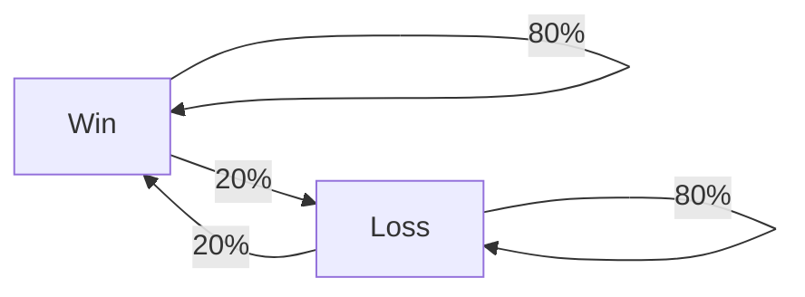
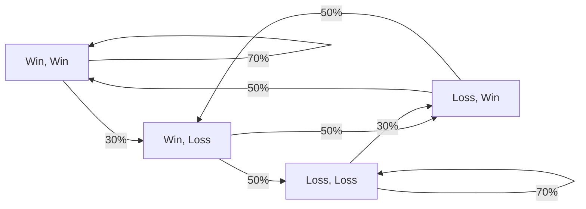

# Some theoretical background

Sorry I lied, that's a lot of theory.

!!! abstract "TL;DR"
    - LoserQ should have a measurable impact on the history of games of players. 
    - As people would lose more right after losing, we should see clear deviation from randomness in the matches, which
      translates as intrinsic correlation between the games, and overall longer streaks.
    - Such a mechanism can be modeled using DTMC, a mathematical tool that can model efficiently the fact that the outcome
      of a game depends on the previous games.
    - Finding the best DTMC to describe the match history can fall under the scope of Bayesian inference. Such a framework
      enable performant model comparison, and can be used to find how much games are correlated. 

## What do I want to find ?

Let's suppose for a second that LoserQ is a real thing. This means, for a given player, that the games played are not 
fair over time. Especially in this kind of streak mechanism, we should see a clear deviation from randomness (which is 
what would happen if each match was perfectly fair and that the probability of winning a game is exactly 50% at each 
match). This deviation, if it exists, should be measurable since many players claim to experience it. In particular, 
we could see that on average, players tend to lose more right after losing, and win more right after winning. In a 
nutshell, we should see that the outcome of a game depends on the previous games, which means that matches outcomes are
correlated one with the other. 

Signatures of the existence of LoserQ could be found in many ways in the match history of players. What comes to my mind 
are the following:

- **Distribution of streak lengths** : we should see that on average, the distribution of streak lengths is skewed toward
longer streaks than what we would observe in a random sequence. This is the direct thing for which many players are 
complaining.
- **Auto-correlation** : the outcome of a game should depend on the previous games. This can be measured using the 
auto-correlation of the sequence of games. If the sequence is random, then the auto-correlation should be close to 0.
- **Probability of winning after a win/loss** : we should see that the probability of winning a game after a win is 
greater than the expected 50%, and that the probability of losing a game after a loss is greater than 50%. 

In my previous analysis, I (quickly) investigated the first and third points, showing that the data is consistent with
what you would expect from random coin flips in term of streak lengths. The probability of losing after a loss was a 
bit higher than what was expected from this elo (2% higher than expected). This could be a signature of the LoserQ, but
it is way too low to explain what people claim to experience, i.e. streaks of 10 losses in a row. Don't get me wrong, 
this doesn't mean that there are no summoners losing or winning that much in a row, but my claim is that these streaks 
are as frequent as what you would expect from randomness. 

## Let's meet with the data

Your history of games can be simply represented as a sequence of wins and losses. If I gather these sequence 
using Riot's API, I can easily plot it as a curve, as shown below. Behold, the history of `mopz24#EUW` :  

<div class="grid cards" markdown>
    
-   <p style='text-align: center;'> **Single history of a player** </p>
    ``` plotly
    {"file_path": "loserQ/assets/history_single_player.json"}
    ```

</div>

As you can see, this looks like a fancy barcode. But there is no way to tell if anything 
special is happening here, but we will find later that there are better ways to display this kind of data 
so that we can learn more about the matchmaking system. A nice thing to do would be to plot this kind of stuff, but 
for several players within the same division. 

<div class="grid cards" markdown>
    
-   <p style='text-align: center;'> **Multiple history of players** </p>
    ``` plotly
    {"file_path": "loserQ/assets/history_multiple_players.json"}
    ```

</div>

This has now become a QRcode where the horizontal lines represent history of games for different players. I'll keep this convention 
in all the website. The pattern you can observe only emerge from the randomness of the process. This visualisation 
by itself has no use, but it is very helpful to construct an intuition about what the data looks like and how it should behave. 

Bigger streak in out sample, some stuff etc.

## Modeling the histories

I should define what to do next, this kind of data needs to be modeled with stuff that can describe such series.

## Markov chains for the win

!!! warning
    This section is an introduction to a mathematical model that will be used to investigate the history of games. This 
    is intended to be a high-level overview of the model, and is not necessary to understand the rest of the website. Feel
    free to skip if you hate maths and equations.

As seen below, game histories are a sequence on binary random variables $X = \text{Win}$ if this is a win and $X = \text{Loss}$ if it's a loss. 
The most straightforward way to model this is to flip a coin at each game, and assign a win or a loss depending on the outcome. 
From a probability point of view, doing this is equivalent to considering a Bernoulli process. Each game outcome is purely 
random, and do not depend on the previous games. In this situation, the outcome of game n°$n$ is a Bernoulli random variable : 

$$
P(X_n = \text{Win}) = p 
$$

The probability $p$ should be close to the player's winrate if we want it to model properly the player's history. Here, 
you might understand that this may be too simplistic, as we know that the outcome of a game can depend on the previous 
games. There are many factors (beside considering LoserQ) that can influence the outcome of a game depending on the previous
games played, such as the player's mood, the tiredness etc. To model this, we should consider a more complex process, 
where the outcome of a game depends on the previous games. This can be achieved using (Discrete Time) Markov Chains.
DTMCs are a very useful tool when it comes to describing random processes where the output at a given time depends on
a finite number of states in the past. Let's illustrate this with a chain which depends on the previous game only. Such
a chain can be represented as a graph :



The mathematical counterpart of this chain is encapsulated within 2 equations : 

$$ \left\{ \begin{array}{l}
P(X_n = \text{Win} | X_{n-1} = \text{Win}) = 80\% \\ P(X_n = \text{Loss} | X_{n-1} = \text{Loss}) = 80\%
 \end{array} \right.
$$

??? note 
    We only need to set half of the probabilities, since they add up to 1. If 
    $P(X_n = \text{Win} | X_{n-1} = \text{Win}) = 80\%$, then $P(X_n = \text{Loss} | X_{n-1} = \text{Win}) = 20\%$. This is
    a constraint that we must remember when setting things up.

These set of equations correspond to a chain where you are much more likely to win after a win, and to lose after a loss.
To draw samples from this chain, we start with a random state, and then we move to the next state with a probability
given by the arrows. For example, if we start with a win, we draw the next result between a win and a loss with a probability
of 80% and 20% respectively. This is a very simple example, but we can imagine more complex chains where the outcome of a 
game depends on the previous two games, or even more.



Here, there are 4 states to consider which are 1: (Win, Win), 2: (Win, Lose), 3: (Lose, Win), 4: (Lose, Lose). This kind
of graph is mathematically equivalent to what we would call a transition matrix $\mathcal{P}$ in the Markov Chain theory.
It is completely equivalent to the following matrix : 

$$
\mathcal{P} = \begin{pmatrix}
0.7 & 0.3 & 0 & 0 \\
0 & 0 & 0.5 & 0.5 \\
0.5 & 0.5 & 0 & 0 \\
0 & 0 & 0.3 & 0.7
\end{pmatrix}
\text{ where } \mathcal{P}_{ij} = P(X_n = \text{state j} | X_{n-1} = \text{state i})
$$

??? note 
    The transition matrix is a stochastic matrix. Each line adds up to 1, which means that the sum of the probabilities
    of moving to the next state is 1. It means that you must end up somewhere at each iteration, which is equivalent to
    saying that the sum of the probabilities of each arrow departing from a node is 1.

??? danger "Nigthmare fuel"
    
    You can imagine monstrosities or other biblically acurate angels when considering that the outcome of a game 
    depends on more previous played games. As the number of states to consider grows exponentially, the associated 
    graph becomes unreadable. For example, the graph below represents a chain where the outcome of a game depends 
    on the previous 4 games.

    ``` mermaid
    graph TB
        LLLL --> |75%| LLLL
        LLLL --> |25%| LLLW
        LLLW --> |67%| LLWL
        LLLW --> |33%| LLWW
        LLWL --> |67%| LWLL
        LLWL --> |33%| LWLW
        LLWW --> |50%| LWWL
        LLWW --> |50%| LWWW
        LWLL --> |67%| WLLL
        LWLL --> |33%| WLLW
        LWLW --> |50%| WLWL
        LWLW --> |50%| WLWW
        LWWL --> |50%| WWLL
        LWWL --> |50%| WWLW
        LWWW --> |34%| WWWL
        LWWW --> |66%| WWWW
        WLLL --> |67%| LLLL
        WLLL --> |33%| LLLW
        WLLW --> |50%| LLWL
        WLLW --> |50%| LLWW
        WLWL --> |50%| LWLL
        WLWL --> |50%| LWLW
        WLWW --> |34%| LWWL
        WLWW --> |66%| LWWW
        WWLL --> |50%| WLLL
        WWLL --> |50%| WLLW
        WWLW --> |34%| WLWL
        WWLW --> |66%| WLWW
        WWWL --> |34%| WWLL
        WWWL --> |66%| WWLW
        WWWW --> |25%| WWWL
        WWWW --> |75%| WWWW
    ```

In the most general case, the probability of winning
a game depends on the $m$ previous game's outcome, which can be written as : 

$$
P(X_n = 1 | X_{n-1}, X_{n-2} ..., X_{n-m}) = f(X_{n-1}, X_{n-2} ..., X_{n-m})
$$

If we consider that the outcome of a game depends only on the previous game, we can write :

$$
P(X_i = 1 | X_{i-1}) = f(X_{i-1})
$$

This is the modelisation I will use in the next sessions in my analysis. In my opinion, this is a very well motivated 
model for the following reasons : 

- It is **simple** to implement and to understand. This kind of model is very handy when it comes to explainability
  (unlike your favorite AI models), and the mathematics behind it are very simple, making it easy to use various 
  observables and compute the associated significance.
- It is **powerful**. This model can capture a lot of different patterns, and can be used to investigate the history
  of games in a very efficient way.
- It is **flexible**. You can easily change the number of previous games to consider, and the probabilities associated
  with each state. This is very useful when you want to investigate different hypothesis about the matchmaking system.

## How to fit the model

<div class="annotate" markdown>
What I will do in this analysis is what we call [statistical inference](https://en.wikipedia.org/wiki/Statistical_inference).
This is the process of deducing the best parametrisation $\theta$ of an arbitrary model from experimental data $D$. This is a very 
common practice in science, and is used in many fields such as physics, astrophysics, biology, etc. There are many way 
to both defining what it means to be the best parameters and finding them according to this criterion. I am personally 
convinced of the superiority of Bayesian inference approaches (1) for this specific task. In this framework, we characterize 
our knowledge on the parameters of a model using probability distributions. We first pour in some *a priori* knowledge 
on what we expect to get. Then, we update our knowledge on the parameters by confronting it to the data. Using Bayes 
formula, the update on our knowledge is quantified as follows : 
</div>

1. <figure markdown="span">
  { width="400" }
  <figcaption>Relevant XKCD</figcaption>
</figure>

$$
P(\theta | D) = \frac{P(D | \theta) P(\theta)}{P(D)}
$$

- $P(\theta)$ is the prior distribution of the parameters. This is our first guess for the values of the parameters. 
  This is the quantity that we will update using the data.
- $P(D | \theta)$ is the likelihood of the data given the parameters. This is the probability of observing the data 
  given the parameters. 
- $P(\theta | D)$ is the posterior distribution of the parameters, which is what we are looking for. This is the 
  probability of the parameters given the data. This distribution, when compared to the distribution $P(\theta)$, is 
  supposed to be much more informative, since we learnt new information using the data.
  
<div class="grid cards" markdown>

-   <p style='text-align: center;'> **What's Bayesian inference ?** </p>
    ``` plotly
    {"file_path": "loserQ/assets/illustration_bayesian.json"}
    ```
    <p style='text-align: justify; width: 80%; margin-left: auto; margin-right: auto;'>
    The prior distribution (blue) is updated using the likelihood of the data, leading to the posterior
    distribution (red) of the parameters, which brings a more constrained value when
    compared to our prior knowledge.
    </p>
</div>

Usually, both the prior and likelihood of the Bayes equation are easy to compute. In the case of a DTMC, we want to 
fit the transition probabilities, which are the parameters of the model. 

- The prior distribution for each transition probability is set to a uniform distribution between 0 and 1 (probabilities 
cannot be out of this range!). This is the least informative prior we can use, and this will not bias the results toward
specific values.
- The likelihood can be computing by unrolling the chains for a given set of transition
probabilities and multiply the probability of each transition. 

But I cannot but emphasize on the fact that the posterior distribution is in general impossible to compute using maths, 
because of the constraints when doing mathematics with probability distributions. In general, we do not solve for this 
distribution, but use mathematical turnarounds to get samples which are distributed according to it. For you to know, 
the most widely used methods use [Markov Chain Monte Carlo](https://en.wikipedia.org/wiki/Markov_chain_Monte_Carlo) approaches to solve this kind of problems, which I 
won't detail much in this website. 

## Why do we even bother with this

Evidence based science is heavily relying on statistics. When you want to make a statement about the world, you need to
quantify something we often refer to as its "significance". This kind of stuff is usually done using the well-known 
`p-value`. This is in general defined as the probability of observing something happening under a given hypothesis. 
Some science consider a result significant if its `p-value` is below 5% (or over 95% depending on the convention). In
Astrophysics, we mostly use `Z-score` which carries the same information. A `Z-score` of $2\sigma$ corresponds to a 95%
`p-value`, a `Z-score` of $3\sigma$ corresponds to a 99.7% `p-value`, and a `Z-score` of $5\sigma$ corresponds to a 
99.9999% `p-value`. To give you an idea, 3$\sigma$ is an acceptable standard in physics, 
$5\sigma$ is the common threshold for a discovery in particle physics at the CERN, and $5.1\sigma$ is the 
significance of the first gravitational waves event detected by LIGO. However, even in academia, many people are not 
clear in their mind about what the `p-value`really is. There are a lot of [over-interpretation](https://en.wikipedia.org/wiki/Misuse_of_p-values)
of this quantity, many people still interpret it as the probability of the hypothesis being true, which is **really** not 
the case.

The Bayesian approach provides us with some great keys to interpret this kind of results. Instead of computing `p-values`,
we rather focus on comparing various models, and find the one which is the best at describing what we actually observe. 
This can be done by computing the ELDP-LOO, which is a barbaric term which describes the predictive power of a model, 
assessed by the behavior of the analysis when removing some data points from the analysis. Below is a qualitative 
representation of model fitting. The under-fitting model will have a low ELDP value since it is bad at reproducing the
data. The over-fitting model will be good at reproducing the data, but will by highly unstable if we test it on new 
data points or remove some when performing the analysis, leading to a low ELDP value too. The good model will be both 
stable when removing some data points, and good at predicting new datapoints, leading to a high ELDP value.


=== "Underfitting"
    <div class="grid cards" markdown>

    -   <p style='text-align: center;'> **Too simplistic model** </p>
        
        ``` plotly
        {"file_path": "loserQ/assets/illustration_under_fitted.json"}
        ```

    </div>

=== "Overfitting"
    <div class="grid cards" markdown>

    -   <p style='text-align: center;'> **Too confident model** </p>
        
        ``` plotly
        {"file_path": "loserQ/assets/illustration_over_fitted.json"}
        ```

    </div>

=== "Good fit"
    <div class="grid cards" markdown>

    -   <p style='text-align: center;'> **Just right** :ok_hand: </p>
        
        ``` plotly
        {"file_path": "loserQ/assets/illustration_nicely_fitted.json"}
        ```

    </div>

=== "True science"
    <div class="grid cards" markdown>

    -   <p style='text-align: center;'> **Best fit with uncertainties** :rocket: Now that's research. </p>
        
        ``` plotly
        {"file_path": "loserQ/assets/illustration_science.json"}
        ```

    </div>

This kind of approach will enable to compare DTMC with different orders, and find the one which describes the data the best.
Even if it is not straightforward and pretty complicated for the non-initiated, this is *in my opinion* the least biased
way to approach such problematics. I bother doing all of this because I want this study to be as good as possible regarding
my academic standards. This is the kind of methodology I would use in my own publications.

## Summary

So what I will do is basically finding the best model to describe the history of games I gathered using the Riot API.
I choose to use DTMC to model this dataset, as it it simple to implement, powerful at describing the dynamics of the 
games, and easily interpretable. By fitting the model using MCMC methods, I will be able to find the transition 
probabilities that describes the best the dataset for different memory size of the DTMC. Finally, by comparing each 
DTMC model using the ELDP-LOO metric, I will be able to find the best model to describe the history of games, and uncover
what is the best way to think what is happening in your League of Legends games.

*[DTMC]: Discrete-time Markov Chain
*[MCMC]: Markov Chain Monte Carlo
*[NUTS]: No-U-Turn Sampler
*[ELDP]: Expected log pointwise predictive density
*[LOO]: Leave One Out