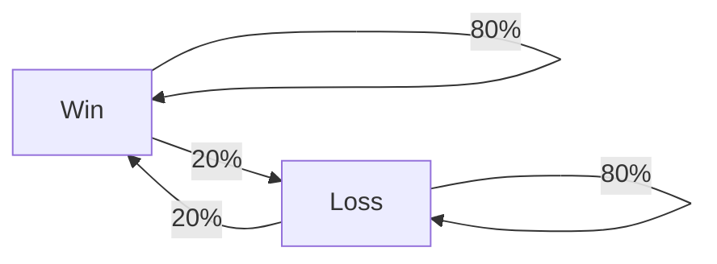
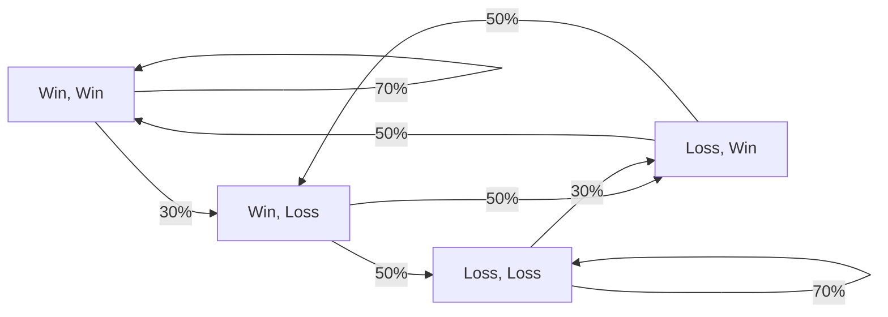

# A bit of theory

Sorry I lied, that's a lot of theory.

!!! abstract "TL;DR"
    - LoserQ should have a measurable effect on players' game histories. 
    - As people would lose more immediately after losing, we should see a clear deviation from randomness in the games, which translates into an intrinsic correlation between the games, and overall longer streaks.
    - Such a mechanism can be modelled using DTMC, a mathematical tool that can efficiently model the fact that the outcome of a game depends on the previous games.
    - Finding the best DTMC to describe the match history can be done within the framework of Bayesian inference. Such a framework allows a powerful comparison of models and can be used to find out how much games are correlated. 

## Introduction
As mentioned in the previous section, it is not possible for me to directly investigate things like "teams are unbalanced from the start", "Riot matches me with people with low win rates", which would be the roots of LoserQ. Riot limit the number of calls per minute to their API. If I had to collect their history for every player, then pick the players in their games and collect the history of those players before the game, it would take eons to build a statistically significant dataset. But if, instead of focusing on the way LoserQ would be implemented, I focus on the effect, the need to call the API is reduced by several orders of magnitude.

Let's assume that LoserQ is a real thing. This means that for a given player, the games played over time are not fair, even if they reach their true rank. Especially in this kind of streak mechanism, we should see a clear deviation from randomness (which is what would happen if every game was perfectly fair and the probability of winning a game in every game was exactly 50%). This deviation, if it exists, should be measurable as many players claim to experience it. In particular, we could see that, on average, players tend to lose more immediately after losing and win more immediately after winning. In short, we should see that the result of a game depends on the previous games, which means that the results of games are correlated. 

The existence of LoserQ could be found in many indirect ways in the game history of players. What comes to mind are the following, which are equivalent ways of presenting the same information:

- **Streak Length Distribution**: We should see that the distribution of streak lengths is, on average, skewed towards longer streaks than what we would observe in a random sequence. This is exactly what many players complain about.
- **Auto-correlation** : The outcome of a game should depend on the previous games. This can be measured by the auto-correlation of the sequence of games. If the sequence is random, the auto-correlation should be close to 0.
- **Probability of winning after a win/loss** : we should see that the probability of winning a game after a win is greater than the expected 50%, and that the probability of losing a game after a loss is greater than 50%. 

In my previous analysis I (quickly) examined the first and third points and showed that the data is consistent with what you would expect from random coin flips in terms of streak lengths. The probability of losing after a loss was slightly higher than expected for this Elo (2% higher than expected). This could be a signature of LoserQ, but it is far too low to explain what people claim to experience, i.e. streaks of 10 losses in a row. Don't get me wrong, this doesn't mean that there aren't summoners who lose or win that much in a row, but I think these streaks are as common as what would happen by pure randomness once they reach their true rank. All of these points can be explored by simply looking at the match history of different players, but I will focus on the third point in this section.

## Let's meet with the data

Your game history can simply be represented as a series of wins and losses. By collecting this sequence using Riot's API, I can easily plot it as a curve, as shown below. Behold, the history of `mopz24#EUW`:  

<div class="grid cards" markdown>
    
-   <p style='text-align: center;'> **Single history of a player** </p>
    ``` plotly
    {"file_path": "loserQ/assets/history_single_player.json"}
    ```

</div>

As you can see, this looks like a fancy barcode. There's no way to tell if there's anything special going on here with just our eyes, we'll have to use maths to go a little further. But first, a nice thing to do would be to plot the match history for several players within the same division. 

<div class="grid cards" markdown>
    
-   <p style='text-align: center;'> **Multiple history of players** </p>
    ``` plotly
    {"file_path": "loserQ/assets/history_multiple_players.json"}
    ```

</div>

This has now become a QR code, with the horizontal lines representing the history of games for different players. I'll keep this convention in all the graphs I show. The pattern you see is only due to the stochastic nature of the process, which can deviate from what you would expect from pure coin flips if there is an underlying mechanism at work. This visualisation is of no use in itself, but it is very helpful in developing an intuition about what the data looks like and how it should behave. Just so you know, all my analysis will be based on such observations. To be precise, I will use a dataset of 

$$ \underbrace{31}_{\text{nb of divisions}} 
\times \underbrace{100}_{\text{nb of players}} 
\times \underbrace{85}_{\text{nb of matches}} = 263500 \ \text{games}$$

which is $\sim2.5$ times larger than the previous dataset, but also much more diverse (100 players per division) and cleanly selected (only highly involved summoners who played at least 200 games in the current split when collected). This dataset is described and available in the [dedicated section](../dataset/introduction.md) of the website. Unfortunately, I can't use the whole dataset at once to do a rigorous analysis. This is because there are many more Silver and Gold players in the ladder than Iron or Challenger players. See for example [what is on LeagueOfGraph](https://www.leagueofgraphs.com/rankings/rank-distribution) on this topic. Using the full dataset would lead to biases towards the extremes of the true distribution of players, as it contains significantly more Challenger or Iron players than would be obtained by randomly selecting players. To mitigate this effect, I reduce it accordingly to represent the true distribution of players. This reduces the total number of players to $\sim 2100$ and the number of games to $\sim 178500$.

## Markov chains for the win

!!! warning
    This section is an introduction to a mathematical model that will be used to investigate the history of games. This is intended to be a high-level overview of the model, and is not necessary to understand the rest of the website. Don't hesitate to skip if you hate maths and equations.

The challenge now is to find a model that can capture the intrinsic correlations in these histories in a quantitative way. As you can see below, game histories are sequences of binary random variables $X = \text{Win}$ if it's a win and $X = \text{Loss}$ if it's a loss. The simplest way to model this would be to flip a coin at each game and assign a win or loss depending on the outcome. From a probability point of view, this is equivalent to looking at a Bernoulli process. The outcome of each game is purely random and does not depend on the previous games. In this situation, the outcome of game $n$ is a Bernoulli random variable: 

$$
P(X_n = \text{Win}) = p 
$$

The probability $p$ should be close to the player's win rate if we want it to properly model the player's history. Here you can see that this may be too simple. The outcome of a game can depend on the previous games. There are many factors (besides considering LoserQ) that can influence the outcome depending on the previous games, such as the player's mood, fatigue, etc. To model this, we should consider a more complex process where the outcome depends on the previous games. This can be achieved using (discrete time) Markov chains (DTMC). DTMC are a very useful tool for describing random processes where the outcome at a given time depends on a finite number of states in the past. Let's illustrate this with a chain that depends only on the previous game. Such a chain can be represented as a graph:



The mathematical counterpart of this chain is encapsulated in 2 equations : 

$$ \left\{ \begin{array}{l}
P(X_n = \text{Win} | X_{n-1} = \text{Win}) = 80\% \\ P(X_n = \text{Loss} | X_{n-1} = \text{Loss}) = 80\%
 \end{array} \right.
$$

We only need to set half of the probabilities because they add up to 1. If $P(X_n = \text{Win} | X_{n-1} = \text{Win}) = 80\%$, then $P(X_n = \text{Loss} | X_{n-1} = \text{Win}) = 20\%$. This is a constraint that we need to remember when setting things up. I will often refer to the probability of the outcome of a game depending on the previous game as the transition probabilities. This set of transition probabilities corresponds to a case where you are much more likely to win after a win, and much more likely to lose after a loss. To draw samples from this chain, we start with a random state and then move to the next state with a probability given by the arrows. For example, if we start with a win, we draw the next outcome between a win and a loss with a probability of 80% and 20% respectively. This is a simple example, but we can imagine more complex chains where the outcome of a game depends on the previous two games, or even more.



Here, there are 4 states to consider which are 1: (Win, Win), 2: (Win, Loss), 3: (Loss, Win), 4: (Loss, Loss). This kind of graph is mathematically equivalent to what we would call a transition matrix $\mathcal{P}$ in Markov chain theory. 

??? Note

    It is fully equivalent to the following matrix 
    
    $$
    \mathcal{P} = \begin{pmatrix}
    0.7 & 0.3 & 0 & 0 \\
    0 & 0 & 0.5 & 0.5 \\
    0.5 & 0.5 & 0 & 0 \\
    0 & 0 & 0.3 & 0.7
    \end{pmatrix}
    \text{ where } \mathcal{P}_{ij} = P(X_n = \text{state j} | X_{n-1} = \text{state i})
    $$

I will also refer to the number of previous games to be considered as the *order* of the chain, which is 2 for the previous game. Don't mind if I call this the *memory* size of the chain. For a chain with $m$ state memory we need to define $2^m$ transition probabilities.

??? danger "Nightmare fuel : DTMC with 4 states"
    
    You can imagine monstrosities or other biblically accurate angels when considering that the outcome of a game depends on more previous played games. As the number of states to consider grows exponentially, the associated graph becomes unreadable. For example, the graph below represents a chain where the outcome of a game depends on the previous 4 games.

    ``` mermaid
    graph TB
        LLLL --> |75%| LLLL
        LLLL --> |25%| LLLW
        LLLW --> |67%| LLWL
        LLLW --> |33%| LLWW
        LLWL --> |67%| LWLL
        LLWL --> |33%| LWLW
        LLWW --> |50%| LWWL
        LLWW --> |50%| LWWW
        LWLL --> |67%| WLLL
        LWLL --> |33%| WLLW
        LWLW --> |50%| WLWL
        LWLW --> |50%| WLWW
        LWWL --> |50%| WWLL
        LWWL --> |50%| WWLW
        LWWW --> |34%| WWWL
        LWWW --> |66%| WWWW
        WLLL --> |67%| LLLL
        WLLL --> |33%| LLLW
        WLLW --> |50%| LLWL
        WLLW --> |50%| LLWW
        WLWL --> |50%| LWLL
        WLWL --> |50%| LWLW
        WLWW --> |34%| LWWL
        WLWW --> |66%| LWWW
        WWLL --> |50%| WLLL
        WWLL --> |50%| WLLW
        WWLW --> |34%| WLWL
        WWLW --> |66%| WLWW
        WWWL --> |34%| WWLL
        WWWL --> |66%| WWLW
        WWWW --> |25%| WWWL
        WWWW --> |75%| WWWW
    ```

The way I'm going to describe match histories is based on this model. In my opinion it is a very well motivated model for the following reasons: 

- It is **simple** to implement and understand. This kind of model is very handy when it comes to interpreting the results (unlike your favourite AI models), and the logic behind it is simple.
- It is **powerful**. This model can capture many patterns, and can be used to study the history of games, even when very fancy mechanisms are involved.

## How to fit the model

What I will be doing in this analysis is what we call [statistical inference] (https://en.wikipedia.org/wiki/Statistical_inference). This is the process of inferring the best parameterisation $\theta$ of an arbitrary model from experimental data $D$. This is a very common practice in science, and is used in many fields such as physics, astrophysics, biology, etc. Here $\theta$ is the value of the $2^m$ transition probabilities of the DTMC of order $m$ we are considering, and $D$ is the data set of hit histories. There are many ways to both define what it means to be the best parameters and to find them according to this criterion. Personally, I am convinced of the superiority of Bayesian inference approaches (1) for this specific task. In this framework, we characterise our knowledge of the parameters of a model using probability distributions. First, we input some prior knowledge about what we expect to get. Then we update our knowledge of the parameters by confronting it with the data. The update of our knowledge is quantified using the Bayes formula:
{.annotate}

1. <figure markdown="span">
  { width="400" }
  <figcaption>Relevant XKCD</figcaption>
</figure>

$$
P(\theta | D) = \frac{P(D | \theta) P(\theta)}{P(D)}
$$

- P(\theta)$ is the prior distribution of the parameters. This is our first guess for the values of the parameters. This is the set we will update with the data.
- P(D | \theta)$ is the likelihood of the data given the parameters. This is the probability of observing the data given the parameters. 
- P(\theta | D)$ is the posterior distribution of the parameters that we are looking for. This is the probability of the parameters given the data, and when compared to the distribution $P(\theta)$, it should be much more informative because we have learned new information from the data.
  
<div class="grid cards" markdown>

-   <p style='text-align: center;'> **What's Bayesian inference ?** </p>
    ``` plotly
    {"file_path": "loserQ/assets/illustration_bayesian.json"}
    ```
    <p style='text-align: justify; width: 80%; margin-left: auto; margin-right: auto;'>
    Using the likelihood of the data, the prior distribution $P(theta)$ (blue) is updated, resulting in the posterior distribution $P(theta|D)$ (red) of the parameters, which provides a more constrained value.
    </p>
</div>

Normally, both the prior and the likelihood of the Bayes equation are easy to calculate. In the case of a DTMC, we want to fit the transition probabilities, which are the parameters of the model. 

- The prior for each transition probability is set to a uniform distribution between 0 and 1 (the probabilities cannot be outside this range!). This is the least informative prior we can use, and it will not bias the results towards particular values.
- The likelihood can be calculated analytically by multiplying the transition probabilities for each transition observed.

For your information, the posterior distribution is generally impossible to calculate using mathematics, because of the limitations of doing mathematics with probability distributions. In general, we do not solve for this distribution, but use mathematical inversions to get samples that are distributed according to it. As you know, the most widely used methods use Markov Chain Monte Carlo approaches to solve these kinds of problems, in particular the `NUTS` sampler[^1]. I won't go into much detail about this on this site, as I think it's far too technical to be of interest to everyone.

## Why do we even bother with this

Evidence-based science relies heavily on statistics. If you want to make a statement about the world, you need to quantify something we often call "significance". This is usually done using the well-known 'p-value'. This is generally defined as the probability of observing something happening under a given hypothesis. In some sciences, a result is considered significant if its p-value is below 5% (or above 95%, depending on the convention). In astrophysics we mostly use the `Z-score', which carries the same information. A `Z-score` of $2\sigma$ corresponds to a 95% `p-value`, a `Z-score` of $3\sigma$ corresponds to a 99.7% `p-value`, and a `Z-score` of $5\sigma$ corresponds to a 99.9999% `p-value`. To give you an idea, $3\sigma$ is an acceptable standard in physics, $5\sigma$ is the common threshold for a discovery in particle physics at CERN, and $5.1\sigma$ is the significance of the [first gravitational wave event detected by LIGO](https://en.wikipedia.org/wiki/First_observation_of_gravitational_waves). But even in science, many people are not clear about what the p-value really is. There is a lot of [over-interpretation](https://en.wikipedia.org/wiki/Misuse_of_p-values) of this quantity, many people still interpret it as the probability that the hypothesis is true, which is really **not** the case.

The Bayesian approach gives us some great keys to interpreting these kinds of results. Rather than calculating 'p-values', we focus on comparing different models and finding the one that best describes what we actually observe. This can be done by calculating the ELDP-LOO[^2][^3], which is a barbaric term that describes the predictive power of a model, assessed by the behaviour of the analysis when some data points are removed from the analysis. Below is a qualitative representation of model fit. The underfitting model will have a low ELDP value as it is poor at reproducing the data. The over-fitting model will be good at reproducing the data, but will be very unstable when we test it on new data points or remove some from the analysis, leading to a low ELDP value as well. The good model will be both stable when we remove some data points and good at predicting new data points, leading to a high ELDP value.

=== "Underfitting"
    <div class="grid cards" markdown>

    -   <p style='text-align: center;'> **Too simplistic model** </p>
        
        ``` plotly
        {"file_path": "loserQ/assets/illustration_under_fitted.json"}
        ```

    </div>

=== "Overfitting"
    <div class="grid cards" markdown>

    -   <p style='text-align: center;'> **Too confident model** </p>
        
        ``` plotly
        {"file_path": "loserQ/assets/illustration_over_fitted.json"}
        ```

    </div>

=== "Good fit"
    <div class="grid cards" markdown>

    -   <p style='text-align: center;'> **Just right** :ok_hand: </p>
        
        ``` plotly
        {"file_path": "loserQ/assets/illustration_nicely_fitted.json"}
        ```

    </div>

=== "True science"
    <div class="grid cards" markdown>

    -   <p style='text-align: center;'> **Best fit with uncertainties** :rocket: Now that's research. </p>
        
        ``` plotly
        {"file_path": "loserQ/assets/illustration_science.json"}
        ```

    </div>

This kind of approach will allow you to compare DTMC with different orders and find the one that best describes the data. Even if it is not straightforward and quite complicated for the non-initiated, this is *in my opinion* the least biased way to approach such problems. I bother to do all this because I want this study to be as good as possible in terms of my academic standards. This is the kind of methodology I would use in my academic publications.

## Summary

So what I will do is basically find the best model to describe the history of the games I have collected using the Riot API. I chose to use DTMC to model this dataset because it is easy to implement, powerful in describing the dynamics of the games, and easy to interpret. By fitting the model using MCMC methods, I will be able to find the transition probabilities that best describe the dataset for different memory sizes of the DTMC. Finally, by comparing each DTMC model using the ELDP-LOO metric, I will be able to find the best model to describe the history of the games. This will help to find out what happens in your League of Legends games.

*[DTMC]: Discrete-time Markov Chain
*[MCMC]: Markov Chain Monte Carlo
*[NUTS]: No-U-Turn Sampler
*[ELDP]: Expected log pointwise predictive density
*[LOO]: Leave One Out

[^1]: [**The No-U-Turn Sampler: Adaptively Setting Path Lengths in Hamiltonian Monte Carlo**, *Hoffman & al* (2014)](https://jmlr.org/papers/volume15/hoffman14a/hoffman14a.pdf)
[^2]: [**Bayesian Measures of Model Complexity and Fit**, *Spiegelhalter & al* (2002)](https://academic.oup.com/jrsssb/article/64/4/583/7098621)
[^3]: [**Using stacking to average Bayesian predictive distributions**, *Yao & al* (2017)](https://arxiv.org/abs/1704.02030)
